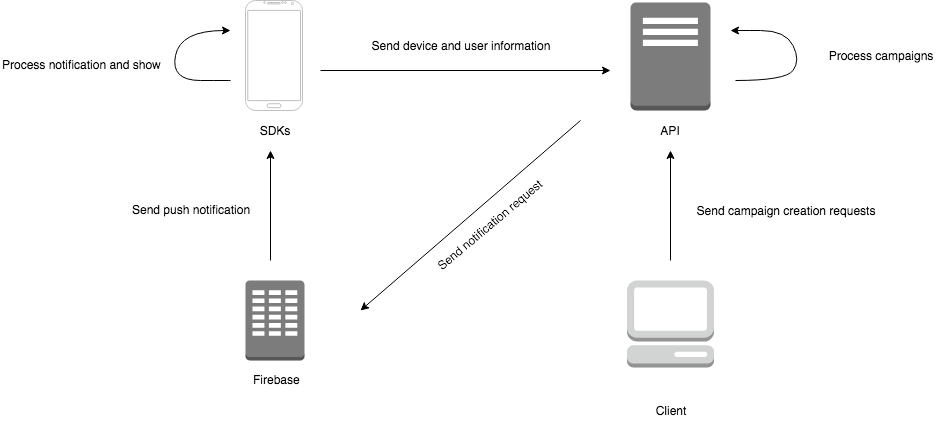

# Welcome to Taki docs

## What is Taki?

Taki is a push notification campaign handler created by Taqtile. It's purpose is to deliver meaningful content to the user, by using personalized campaigns and customized content.

## What are it's capabilities

With Taki, you will be able to:

- Create recurring campaigns that will send segmented push notifications for your app users.
- Prevent the user from receiving too many notifications that are not meaningful to him.
- Send customized push notifications, with the user's name on the message for example.
- Send push notifications that the app will process in order to do something, like redirecting to a specific screen.

## What do I need before using Taki?

The only requirements before integrating Taki is to have Firebase Cloud Messaging integrated on your apps (you also need to configure the push notification certificates and keys), and a client that will be responsible for sending the user informations to our API.

It's also good to have an idea about what campaigns you want to create, in order to start populating the database with useful informations before the campaigns start.

## How does it work?

Taki is composed by 2 main parts, and it's good to be familiar with their names and roles before we move on:

- API: Responsible for handling all requests containing campaign and user information.
- SDKs: The SDKs (for Android and iOS) are integrated to the app and are responsible for sending the device/user information that will be used to segment the notification audience to the Taki servers and to Firebase. It will also handle push notifications, in order to edit content and decide if the notification should be shown.

Here's a diagram showing the information flow:

Click [here](api.md) for more details about the API

Click [here](android-sdk.md) for more details about the Android SDK

Click [here](ios-sdk.md) for more details about the iOS SDK